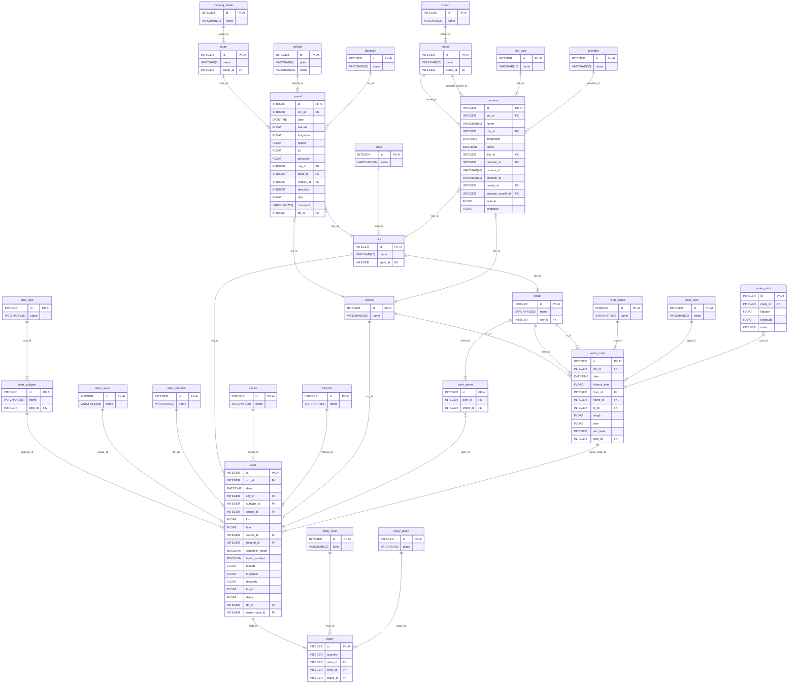
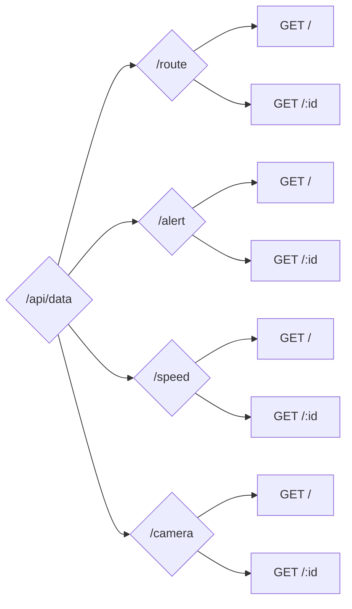
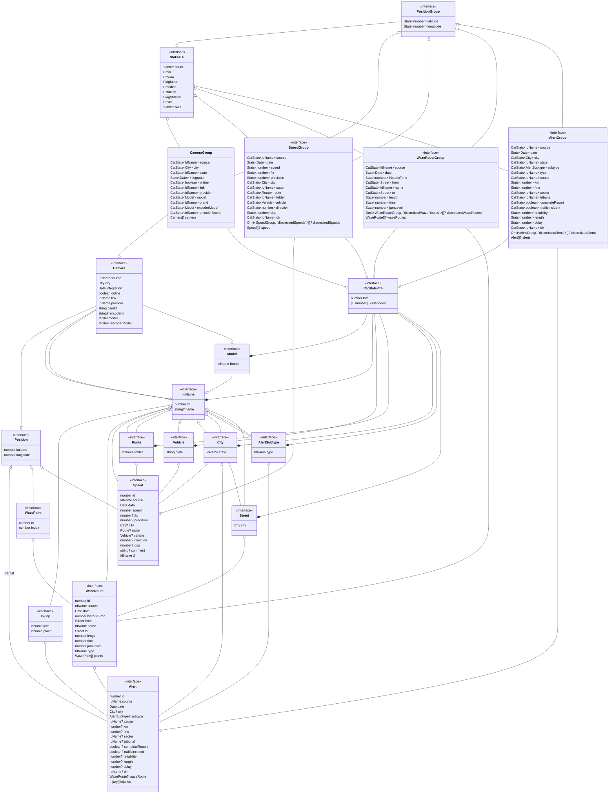

# Introducción

Este documento describe la estructura de la base de datos y los endpoints de la API desarrollada para la gestión y consulta de datos de movilidad urbana, incluyendo accidentes, alertas de tráfico, mediciones de velocidad, rutas y cámaras de vigilancia.

# Tablas de la Base de Datos

A continuación se presentan las tablas que componen la base de datos, indicando sus fuentes de datos y las columnas que las integran.

El Modelo Entidad Relación se encuentra en los [anexos](#modelo-entidad-relación).

## source

**Fuente(s)**:

- Siniestros buses interurbanos(1).xlsx
- GH026929.xlsx
- DTPR
- Data accidentes de carabineros.xlsx
- Incidentes de tráfico radio.xlsx
- Med velo CHIGUAYANTE.xlsx
- Med velo LA VEGA.xlsx
- Alertas de Tráfico.csv
- Copia de Accidentes.csv
- Waze for Cities Data Key Alerts Dashboard_Traffic Irregularities_Tabla(1).csv
- Red de Waze

**Columnas**:

- `id`: `INTEGER`, `PRIMARY KEY`, `AUTOINCREMENT`
- `name`: `VARCHAR(255)`

## state

**Fuente(s)**:

- Siniestros buses interurbanos(1).xlsx
- Data accidentes de carabineros.xlsx
- Inventario CCTV Biobío(1).xlsx

**Columnas**:

- `id`: `INTEGER`, `PRIMARY KEY`, `AUTOINCREMENT`
- `name`: `VARCHAR(20)`

## city

**Fuente(s)**:

- Siniestros buses interurbanos(1).xlsx
- Data accidentes de carabineros.xlsx
- Inventario CCTV Biobío(1).xlsx
- Alertas de Tráfico.csv
- Copia de Accidentes.csv

**Columnas**:

- `id`: `INTEGER`, `PRIMARY KEY`, `AUTOINCREMENT`
- `name`: `VARCHAR(20)`
- `state_id`: `INTEGER`, `FOREIGN KEY` (`id` - [state](#state))

## sector

**Fuente(s)**:

- Siniestros buses interurbanos(1).xlsx
- Data accidentes de carabineros.xlsx

**Columnas**:

- `id`: `INTEGER`, `PRIMARY KEY`, `AUTOINCREMENT`
- `name`: `VARCHAR(20)`

## street

**Fuente(s)**:

- Siniestros buses interurbanos(1).xlsx
- Data accidentes de carabineros.xlsx
- Alertas de Tráfico.csv
- Copia de Accidentes.csv
- Waze for Cities Data Key Alerts Dashboard_Traffic Irregularities_Tabla(1).csv
- Red de Waze

**Columnas**:

- `id`: `INTEGER`, `PRIMARY KEY`, `AUTOINCREMENT`
- `name`: `VARCHAR(255)`
- `city_id`: `INTEGER`, `FOREIGN KEY` (`id` - [city](#city))

## tribunal

**Fuente(s)**:

- Data accidentes de carabineros.xlsx

**Columnas**:

- `id`: `INTEGER`, `PRIMARY KEY`, `AUTOINCREMENT`
- `name`: `VARCHAR(255)`

## alert_type

**Fuente(s)**:

- Siniestros buses interurbanos(1).xlsx
- Data accidentes de carabineros.xlsx
- Incidentes de tráfico radio.xlsx

**Columnas**:

- `id`: `INTEGER`, `PRIMARY KEY`, `AUTOINCREMENT`
- `name`: `VARCHAR(255)`

## alert_subtype

**Fuente(s)**:

- Siniestros buses interurbanos(1).xlsx
- Data accidentes de carabineros.xlsx
- Incidentes de tráfico radio.xlsx

**Columnas**:

- `id`: `INTEGER`, `PRIMARY KEY`, `AUTOINCREMENT`
- `name`: `VARCHAR(255)`
- `type_id`: `INTEGER`, `FOREIGN KEY` (`id` - [alert_type](#alert_type))

## alert_direction

**Fuente(s)**:

- Incidentes de tráfico radio.xlsx

**Columnas**:

- `id`: `INTEGER`, `PRIMARY KEY`, `AUTOINCREMENT`
- `name`: `VARCHAR(10)`

## alert_cause

**Fuente(s)**:

- Siniestros buses interurbanos(1).xlsx
- Data accidentes de carabineros.xlsx
- Waze for Cities Data Key Alerts Dashboard_Traffic Irregularities_Tabla(1).csv

**Columnas**:

- `id`: `INTEGER`, `PRIMARY KEY`, `AUTOINCREMENT`
- `name`: `VARCHAR(255)`

## route_name

**Fuente(s)**:

- Red de Waze

**Columnas**:

- `id`: `INTEGER`, `PRIMARY KEY`, `AUTOINCREMENT`
- `name`: `VARCHAR(255)`

## route_type

**Fuente(s)**:

- Red de Waze

**Columnas**:

- `id`: `INTEGER`, `PRIMARY KEY`, `AUTOINCREMENT`
- `name`: `VARCHAR(10)`

## waze_route

**Fuente(s)**:

- Red de Waze

**Columnas**:

- `id`: `INTEGER`, `PRIMARY KEY`, `AUTOINCREMENT`
- `src_id`: `INTEGER`, `FOREIGN KEY` (`id` - [source](#source))
- `date`: `DATETIME`
- `historic_time`: `FLOAT`
- `from_id`: `INTEGER`, `FOREIGN KEY` (`id` - [street](#street))
- `name_id`: `INTEGER`, `FOREIGN KEY` (`id` - [route_name](#route_name))
- `to_id`: `INTEGER`, `FOREIGN KEY` (`id` - [street](#street))
- `length`: `FLOAT`
- `time`: `FLOAT`
- `jam_level`: `INTEGER`
- `type_id`: `INTEGER`, `FOREIGN KEY` (`id` - [route_type](#route_type))

## route_point

**Fuente(s)**:

- Red de Waze

**Columnas**:

- `id`: `INTEGER`, `PRIMARY KEY`, `AUTOINCREMENT`
- `route_id`: `INTEGER`, `FOREIGN KEY` (`id` - [waze_route](#waze_route))
- `latitude`: `FLOAT`
- `longitude`: `FLOAT`
- `index`: `INTEGER`

## alert

**Fuente(s)**:

- Siniestros buses interurbanos(1).xlsx
- Data accidentes de carabineros.xlsx
- Incidentes de tráfico radio.xlsx
- Alertas de Tráfico.csv
- Copia de Accidentes.csv
- Waze for Cities Data Key Alerts Dashboard_Traffic Irregularities_Tabla(1).csv
- Red de Waze

**Columnas**:

- `id`: `INTEGER`, `PRIMARY KEY`, `AUTOINCREMENT`
- `src_id`: `INTEGER`, `FOREIGN KEY` (`id` - [source](#source))
- `date`: `DATETIME`
- `city_id`: `INTEGER`, `FOREIGN KEY` (`id` - [city](#city))
- `subtype_id`: `INTEGER`, `FOREIGN KEY` (`id` - [alert_subtype](#alert_subtype))
- `cause_id`: `INTEGER`, `FOREIGN KEY` (`id` - [alert_cause](#alert_cause))
- `km`: `FLOAT`
- `fine`: `FLOAT`
- `sector_id`: `INTEGER`, `FOREIGN KEY` (`id` - [sector](#sector))
- `tribunal_id`: `INTEGER`, `FOREIGN KEY` (`id` - [tribunal](#tribunal))
- `complete_report`: `BOOLEAN`
- `traffic_incident`: `BOOLEAN`
- `latitude`: `FLOAT`
- `longitude`: `FLOAT`
- `reliability`: `FLOAT`
- `length`: `FLOAT`
- `delay`: `FLOAT`
- `dir_id`: `INTEGER`, `FOREIGN KEY` (`id` - [alert_direction](#alert_direction))
- `waze_route_id`: `INTEGER`, `FOREIGN KEY` (`id` - [waze_route](#waze_route))

## injury_level

**Fuente(s)**:

- Siniestros buses interurbanos(1).xlsx

**Columnas**:

- `id`: `INTEGER`, `PRIMARY KEY`, `AUTOINCREMENT`
- `level`: `VARCHAR(15)`

## injury_place

**Fuente(s)**:

- Siniestros buses interurbanos(1).xlsx

**Columnas**:

- `id`: `INTEGER`, `PRIMARY KEY`, `AUTOINCREMENT`
- `place`: `VARCHAR(5)`

## injury

**Fuente(s)**:

- Siniestros buses interurbanos(1).xlsx
- Waze for Cities Data Key Alerts Dashboard_Traffic Irregularities_Tabla(1).csv

**Columnas**:

- `id`: `INTEGER`, `PRIMARY KEY`, `AUTOINCREMENT`
- `quantity`: `INTEGER`
- `alert_id`: `INTEGER`, `FOREIGN KEY` (`id` - [alert](#alert))
- `level_id`: `INTEGER`, `FOREIGN KEY` (`id` - [injury_level](#injury_level))
- `place_id`: `INTEGER`, `FOREIGN KEY` (`id` - [injury_place](#injury_place))

## alert_street

**Fuente(s)**:

- Siniestros buses interurbanos(1).xlsx
- Data accidentes de carabineros.xlsx
- Alertas de Tráfico.csv
- Copia de Accidentes.csv
- Waze for Cities Data Key Alerts Dashboard_Traffic Irregularities_Tabla(1).csv
- Red de Waze

**Columnas**:

- `id`: `INTEGER`, `PRIMARY KEY`, `AUTOINCREMENT`
- `alert_id`: `INTEGER`, `FOREIGN KEY` (`id` - [alert](#alert))
- `street_id`: `INTEGER`, `FOREIGN KEY` (`id` - [street](#street))

## tracking_folder

**Fuente(s)**:

- DTPR

**Columnas**:

- `id`: `INTEGER`, `PRIMARY KEY`, `AUTOINCREMENT`
- `name`: `VARCHAR(10)`

## route

**Fuente(s)**:

- DTPR

**Columnas**:

- `id`: `INTEGER`, `PRIMARY KEY`, `AUTOINCREMENT`
- `name`: `VARCHAR(5)`
- `folder_id`: `INTEGER`, `FOREIGN KEY` (`id` - [tracking_folder](#tracking_folder))

## vehicle

**Fuente(s)**:

- DTPR
- Med velo CHIGUAYANTE.xlsx
- Med velo LA VEGA.xlsx

**Columnas**:

- `id`: `INTEGER`, `PRIMARY KEY`, `AUTOINCREMENT`
- `plate`: `VARCHAR(6)`
- `name`: `VARCHAR(20)`

## direction

**Fuente(s)**:

- Med velo CHIGUAYANTE.xlsx
- Med velo LA VEGA.xlsx

**Columnas**:

- `id`: `INTEGER`, `PRIMARY KEY`, `AUTOINCREMENT`
- `name`: `VARCHAR(20)`

## speed

**Fuente(s)**:

- GH026929.xlsx
- DTPR
- Med velo CHIGUAYANTE.xlsx
- Med velo LA VEGA.xlsx

**Columnas**:

- `id`: `INTEGER`, `PRIMARY KEY`, `AUTOINCREMENT`
- `src_id`: `INTEGER`, `FOREIGN KEY` (`id` - [source](#source))
- `date`: `DATETIME`
- `latitude`: `FLOAT`
- `longitude`: `FLOAT`
- `speed`: `FLOAT`
- `fix`: `FLOAT`
- `precision`: `FLOAT`
- `city_id`: `INTEGER`, `FOREIGN KEY` (`id` - [city](#city))
- `route_id`: `INTEGER`, `FOREIGN KEY` (`id` - [route](#route))
- `vehicle_id`: `INTEGER`, `FOREIGN KEY` (`id` - [vehicle](#vehicle))
- `direction`: `INTEGER`
- `dop`: `FLOAT`
- `comment`: `VARCHAR(255)`
- `dir_id`: `INTEGER`, `FOREIGN KEY` (`id` - [direction](#direction))

## brand

**Fuente(s)**:

- Inventario CCTV Biobío(1).xlsx

**Columnas**:

- `id`: `INTEGER`, `PRIMARY KEY`, `AUTOINCREMENT`
- `name`: `VARCHAR(20)`

## model

**Fuente(s)**:

- Inventario CCTV Biobío(1).xlsx

**Columnas**:

- `id`: `INTEGER`, `PRIMARY KEY`, `AUTOINCREMENT`
- `name`: `VARCHAR(25)`
- `brand_id`: `INTEGER`, `FOREIGN KEY` (`id` - [brand](#brand))

## link_type

**Fuente(s)**:

- Inventario CCTV Biobío(1).xlsx

**Columnas**:

- `id`: `INTEGER`, `PRIMARY KEY`, `AUTOINCREMENT`
- `name`: `VARCHAR(10)`

## provider

**Fuente(s)**:

- Inventario CCTV Biobío(1).xlsx

**Columnas**:

- `id`: `INTEGER`, `PRIMARY KEY`, `AUTOINCREMENT`
- `name`: `VARCHAR(30)`

## camera

**Fuente(s)**:

- Inventario CCTV Biobío(1).xlsx

**Columnas**:

- `id`: `INTEGER`, `PRIMARY KEY`, `AUTOINCREMENT`
- `src_id`: `INTEGER`, `FOREIGN KEY` (`id` - [source](#source))
- `name`: `VARCHAR(50)`
- `city_id`: `INTEGER`, `FOREIGN KEY` (`id` - [city](#city))
- `integration`: `DATETIME`
- `online`: `BOOLEAN`
- `link_id`: `INTEGER`, `FOREIGN KEY` (`id` - [link_type](#link_type))
- `provider_id`: `INTEGER`, `FOREIGN KEY` (`id` - [provider](#provider))
- `camera_id`: `VARCHAR(20)`
- `encoder_id`: `VARCHAR(20)`
- `model_id`: `INTEGER`, `FOREIGN KEY` (`id` - [model](#model))
- `encoder_model_id`: `INTEGER`, `FOREIGN KEY` (`id` - [model](#model))
- `latitude`: `FLOAT`
- `longitude`: `FLOAT`

# Endpoints de la API

La API está organizada en cuatro recursos principales: rutas, alertas, velocidades y cámaras. Cada recurso soporta consultas con filtros avanzados y devuelve datos estructurados en formato JSON.

[Anexos](#estructura-de-la-api)

## `GET /api/data/route`

**Descripción**: Obtiene un conjunto de rutas de Waze.

**Parámetros de consulta**:

- `token` (requerido)
- `src` (fuente)
- `min_date`, `max_date` (rango temporal)
- `min_lat`, `max_lat`, `min_lng`, `max_lng` (rango geográfico)
- `disc_spc`, `disc_temp` (discretización espacial y temporal en metros y segundos)

**Respuesta**: Objeto [`WazeRouteGroup`](#tipos-de-typescript).

## `GET /api/data/route/:id`

**Descripción**: Obtiene una ruta específica por ID.

**Parámetros de consulta**:

- `token` (requerido)

**Parámetros de URL**:

- `id`: ID de la ruta de waze

**Respuesta**: Objeto [`WazeRoute`](#tipos-de-typescript) individual.

## `GET /api/data/alert`

**Descripción**: Consulta alertas y accidentes con múltiples filtros.

**Parámetros de consulta**:

- `token` (requerido)
- `src` (fuente)
- `min_date`, `max_date` (rango temporal)
- `min_lat`, `max_lat`, `min_lng`, `max_lng` (rango geográfico)
- `disc_spc`, `disc_temp` (discretización espacial y temporal en metros y segundos)
- `state`, `city` (comuna y región)
- `type`, `subtype` (clasificación de alerta/accidente)
- `min_km`, `max_km` (rango de kilómetros)
- `min_fine`, `max_fine` (rango de partes)
- `sector` (sector)
- `tribunal` (tribunal)
- `complete_report` (`0`: no es un reporte completo; `1`: es un reporte completo)
- `traffic_incident` (`0`: no es accidente de tráfico; `1`: es accidente de tráfico)
- `min_rel`, `max_rel` (rango de confiabilidades)
- `min_len`, `max_len` (rango de largos)
- `min_del`, `max_del` (rango de desfases)
- `dir` (dirección: `N-S`, `S-N`, etc)

**Respuesta**: Objeto [`AlertGroup`](#tipos-de-typescript).

## `GET /api/data/alert/:id`

**Descripción**: Obtiene una alerta específica por ID.

**Parámetros de consulta**:

- `token` (requerido)

**Parámetros de URL**:

- `id`: ID de la alerta o accidente

**Respuesta**: Objeto [`Alert`](#tipos-de-typescript) individual.

## `GET /api/data/speed`

**Descripción**: Consulta medidas de velocidad con múltiples filtros.

**Parámetros de consulta**:

- `token` (requerido)
- `src` (fuente)
- `min_date`, `max_date` (rango temporal)
- `min_lat`, `max_lat`, `min_lng`, `max_lng` (rango geográfico)
- `disc_spc`, `disc_temp` (discretización espacial y temporal en metros y segundos)
- `min_spd`, `max_spd` (rango de velocidades)
- `min_fix`, `max_fix` (rango de fixes)
- `min_pres`, `max_pres` (rango de presiciones)
- `state`, `city` (comuna y región)
- `folder`, `route` (carpeta y recorrido)
- `vh_type`, `plate` (tipo y patente del vehículo)
- `direction` (dirección: `-1`, `0` o `1`)
- `min_dop`, `max_dop`: (rango de presiones geométricas)

**Respuesta**: Objeto [`SpeedGroup`](#tipos-de-typescript).

## `GET /api/data/speed/:id`

**Descripción**: Obtiene una medida específica por ID.

**Parámetros de consulta**:

- `token` (requerido)

**Parámetros de URL**:

- `id`: ID de la medida

**Respuesta**: Objeto [`Speed`](#tipos-de-typescript) individual.

## `GET /api/data/camera`

**Descripción**: Consulta cámaras con múltiples filtros.

**Parámetros de consulta**:

- `token` (requerido)
- `src` (fuente)
- `min_int`, `max_int` (fechas de integración)
- `min_lat`, `max_lat`, `min_lng`, `max_lng` (rango geográfico)
- `state`, `city` (comuna y región)
- `online` (`0`: la cámara no está online o `1`: la cámara está online)
- `link` (tipo de enlace)
- `prov` (proveedor)
- `brand`, `model`, `enc_brand`, `enc_model` (marca y modelo de la cámara y el codificador de video)

**Respuesta**: Objeto [`CameraGroup`](#tipos-de-typescript).

## `GET /api/data/camera/:id`

**Descripción**: Obtiene una cámara específica por ID.

**Parámetros de consulta**:

- `token` (requerido)

**Parámetros de URL**:

- `id`: ID de la cámara

**Respuesta**: Objeto [`Camera`](#tipos-de-typescript) individual.

# Anexos

## Modelo Entidad Relación

El diagrama completo del modelo de base de datos está disponible en formato Mermaid:

[Ver modelo ER](https://mermaid.live/edit#pako:eNq9WFtzmzoQ_iuMnnpmkgy-xubNp3XbTC_ppJnzcMYzHgVkWw1IVBZpnMT_vUJCGIQgwaHlxQZ9Wq12V7vf6hH4NEDAA4i9w3DNYLQgjni2HHLkPKqX9Ln4ej3_ML9ycOAswLdPzuxiAQ6j_82u3n6cXb3pu_84BEZIjewXRP3xMd-9VlhxntRuKWe__6Sn5qttkc8p60z5LWcI8SPEjUZ1-qf2qFWfM3yTEBi-esVcIgwR40u-i1HXMrfJTSdiixNTgbXGUcsGmAkfY0raL9xzG7bjw2TboY0YTUSYpgNdyzzO6DV7_wUf0FLKfbnI_CQy3_RV-rybXc-vL77MnUAc1MPn958vZ9fOBm_F-cT-kmOb_1eMRjaZejzdQdM4p7ZRtXSIyJpvzK92PX7AaBmiOxS2DFHloZhiwtvbU02u1x9yzJOgYtKQkrUxkK9HAnRvi_Y_7eymZFeSqnJIE0Sey3qr3EbmlxUmtrIhC0Nj7GS514b59_Ly83z21fFpFIdIeImhmDJeBXAGVysR3pj4OECEv8KJaoChEMMbHApDviygAxTCXXV3Im02bf6QB2pjG5MfCdupY3FE_hEprXCiTKlxCP0jspoQKmdahbYP8p8JJLxkaT2iakSDAeXemgBSz2dqW1u68WLtlOAG2gH9W0zWyxUNA8Q6qy4tC0vBq3Z6oNSr3cYd2mA_PGLBsQyjYgJ7hhe-goTUMc0YoeDv1ODWOUjqVk2z9-anWBgFb4VV2heC2tqnAZlvmyC5UyopkcY1JEvk86iUpRvSZe6qGwZJ0JnjI9GDHcX36w6JVK9W-RCT224pZMzoHT4qawxqOkbxicHOzkKeVdw2LVnpFAk6h0R_XI4tXfIpCa2MQ1q6qSBkdmvSOY0ZZQ6Bsg8jknbxrDSul5Cx1aSDnlwLbJUxDsmMJszvsPFRZ-Tp6fT06VGHh5fvrgljbrCkXwY-cB8vi6FiSt6noCd1jeHpUClelOglFUBfTxQuPzJAVtwNGYX-PMOVu2tPNxy21rs4I107Z9PVxtaAalZt76wNsEqG36tbyqWVrKKuYEzdNP82LjoMWIGE21wlYYaXlFnLxtOmznmPDVvofT3deT6Lkx2mhbNlYaL3oRlZsefKxGXk1MSU6LUJ1ezSwplNqOaZlWsI226yfrpyvWDdeTG0io1utvUSWNfzyi2D4e9S31FK_w3nzqSrmczclZolFkmoPoTyTJv6aeJogA6cw2R9BlAdEEvWUNFbDlhFHzIJKmt5edE2i7SZz7KiYlReE1UoLTablrUCJ2DNxI_HWYJOgABGMH0FMn0vAN8gkZCBJ_4GkN2meXsv5sSQ_E9ppKcJg643wFvBcCvekjglntmtcg5BROj0liaEA2_QG_WlEOA9gnvgnY56_bNBbzLuTc8nw36vNzoBO_F5Oj4bTIbjgTsdT8-H7nC4PwEPct3B2ei857ruoD8Zu5PpaDrY_wZyUZSX)



## Estructura de la API

Diagrama de flujo de los endpoints disponibles:

[preview](https://mermaid.live/edit#pako:eNptkD1vwyAURf-K9YZOTgw2BpuhS1t16VR1ap2BhhfbavwhjNUP5P9enMRNI4WJA-dexHOw7TSChN2--9xWytjg6bloA7_e1YAuUn0daWXVFKxWt8eLcUDiItONFqfgZkbqvT0ae8LYRUOPqE-YuGirGjRqOufntqBES8jb48NLEG28OiM9oqz15k-mi0wvZXpNjhc5vpTja3KyyMmlnPyTIYTS1BqkNSOG4P_RqBnBzTUF2AobLED6rVbmo4CinXymV-1r1zVLzE-rrEDu1H7wNPZ-pHhfq9Kos4KtRnPXja0FmWUsO5SAdPAFcsXJOmUiyxnlTDBBeQjf_pjyZM3TVKQ5J7mgJBVTCD-Hh-k6pSLnPBaEMS6ESKZfi86RHw)



## Tipos de Typescript

Interfaces completas para los objetos devueltos por la API, incluyendo:

- `WazeRoute`, `Alert`, `Speed`, `Camera`
- Estructuras de agrupación: `WazeRouteGroup`, `AlertGroup`, etc.
- Estadísticas y categorías

```typescript
export interface IdName {
  id: number;
  name?: string;
}

export interface Position {
  latitude: number;
  longitude: number;
}

export interface City extends IdName {
  state: IdName;
}

export interface Street extends IdName {
  city: City;
}

export interface WazePoint extends Position {
  id: number;
  index: number;
}

export interface WazeRoute {
  id: number;
  source: IdName;
  date: Date;
  historicTime: number;
  from: Street;
  name: IdName;
  to: Street;
  length: number;
  time: number;
  jamLevel: number;
  type: IdName;
  points: WazePoint[];
}

export interface AlertSubtype extends IdName {
  type: IdName;
}

export interface Injury {
  level: IdName;
  place: IdName;
}

export interface Alert extends Partial<Position> {
  id: number;
  source: IdName;
  date: Date;
  city?: City;
  subtype?: AlertSubtype;
  cause?: IdName;
  km?: number;
  fine?: number;
  sector?: IdName;
  tribunal?: IdName;
  completeReport?: boolean;
  trafficIncident?: boolean;
  reliability?: number;
  length?: number;
  delay?: number;
  dir?: IdName;
  wazeRoute?: WazeRoute;
  injuries?: Injury[];
}

export interface Route extends IdName {
  folder: IdName;
}

export interface Vehicle extends IdName {
  plate: string;
}

export interface Speed extends Position {
  id: number;
  source: IdName;
  date: Date;
  speed: number;
  fix?: number;
  precision?: number;
  city?: City;
  route?: Route;
  vehicle?: Vehicle;
  direction?: number;
  dop?: number;
  comment?: string;
  dir?: IdName;
}

export interface Model extends IdName {
  brand: IdName;
}

export interface Camera extends IdName, Position {
  source: IdName;
  city: City;
  integration: Date;
  online: boolean;
  link: IdName;
  provider: IdName;
  camId: string;
  encoderId?: string;
  model: Model;
  encoderModel?: Model;
}

export interface Stats<T> {
  count: number;
  min: T;
  mean: T;
  logMean: T;
  median: T;
  max: T;
  stdDev: T;
  logStdDev: T;
  NAs: number;
}

export interface CatStats<T> {
  total: number;
  categories: [T, number][];
  NAs: number;
}

export interface PositionGroup {
  latitude: Stats<number>;
  longitude: Stats<number>;
}

export interface WazeRouteGroup extends PositionGroup {
  source: CatStats<IdName>;
  date: Stats<Date>;
  historicTime: Stats<number>;
  from: CatStats<Street>;
  name: CatStats<IdName>;
  to: CatStats<Street>;
  length: Stats<number>;
  time: Stats<number>;
  jamLevel: Stats<number>;
  type: CatStats<IdName>;
  discretizedWazeRoutes?: Omit<WazeRouteGroup, "discretizedWazeRoutes">[];
  wazeRoutes?: WazeRoute[];
}

export interface AlertGroup extends PositionGroup {
  source: CatStats<IdName>;
  date: Stats<Date>;
  city: CatStats<City>;
  state: CatStats<IdName>;
  subtype: CatStats<AlertSubtype>;
  type: CatStats<IdName>;
  cause: CatStats<IdName>;
  km: Stats<number>;
  fine: Stats<number>;
  sector: CatStats<IdName>;
  tribunal: CatStats<IdName>;
  completeReport: CatStats<boolean>;
  trafficIncident: CatStats<boolean>;
  reliability: Stats<number>;
  length: Stats<number>;
  delay: Stats<number>;
  dir: CatStats<IdName>;
  discretizedAlerts?: Omit<AlertGroup, "discretizedAlerts">[];
  alerts?: Alert[];
}

export interface SpeedGroup extends PositionGroup {
  source: CatStats<IdName>;
  date: Stats<Date>;
  speed: Stats<number>;
  fix: Stats<number>;
  precision: Stats<number>;
  city: CatStats<City>;
  state: CatStats<IdName>;
  route: CatStats<Route>;
  folder: CatStats<IdName>;
  vehicle: CatStats<Vehicle>;
  direction: CatStats<number>;
  dop: Stats<number>;
  dir: CatStats<IdName>;
  discretizedSpeeds?: Omit<SpeedGroup, "discretizedSpeeds">[];
  speeds?: Speed[];
}

export interface CameraGroup extends PositionGroup {
  source: CatStats<IdName>;
  city: CatStats<City>;
  state: CatStats<IdName>;
  integration: Stats<Date>;
  online: CatStats<boolean>;
  link: CatStats<IdName>;
  provider: CatStats<IdName>;
  model: CatStats<Model>;
  brand: CatStats<IdName>;
  encoderModel: CatStats<Model>;
  encoderBrand: CatStats<IdName>;
  cameras: Camera[];
}
```

## Visualización de tipos

Diagrama de clases interactivo que muestra las relaciones entre interfaces:

[Ver diagrama de clases](https://mermaid.ai/play?utm_medium=toggle&utm_source=mermaid_live_editor#pako:eNqtWF1v3CoQ_StoH6-6f6CKuupNpKtIN23URO1DkgfWZje0Nqwwmyb98G-_YMMwAzi3avqS2OcMA8wMc_B-XzW6FavXq6bjw3Am-d7w_lYxNr2z8_Yd7wX77hHG1LHfCsNkO78O1ki13zDlTDzy81alkZd6kFZqlY3tuJX22AoKarUHlHg5lfYpeghrGSy3peGVNULYaDoNa9yfwu4T_yYutVR2YU_xVbXisTr4gz7apYDEFeqjacIOz9xiWRtWDAPu5WC1kc217AMR1r8zuie-YmzBwmoaOqH29p5AFpwG4DPv_xUPoiOO7dMhWEFIbu7Ywf8fio2_7YSxV8etH5SlI_oh9ufq89HkieuKNRw63oj6ZL8dYZ_6DeSekaVv2DA_YGfOmB8HErEN-9LT951U2aBBNC6FFHPnYXtUPGxyq3UnuHL-dX_ohBUfxEEbm5HW8N1ONueqka1Qlk5rRCf5Vnawm0iUad-wVnT8iS6olSbleKrcDfsaH4PplCqXeukfpCiTTyo-JGCnu1aYwvSjuJdNB8Zzg_Bprp3YgxDtSw_S4J3kqXqkwMGIRg6uFdULJITFpJCEXWzYw_yQhVk6fxbcAawPtCu6rPeQ0LChkA8ShwvXf7ssvFvDVVs2Q0cZnrdDFCPS9kLI3HkWrqenBYfKY1p1WVEzB3yhB9ToBxkSDelseH-eKYBQXkVMhOct9f4vAsDsIhJZB-d2GK9HWhGNPsYYXrNeKnh0W4jPnd5foNdetDK9DbY9Ew_I9IoAPSfVwt69HSpxt_XFWW3jYb-5fhXQO3eWGhf5va6epqiL_7iCO8Rczu7n8WOmkRm3KJVwxIlnWPuc0ZHUy8z4MhnR0aITllIFLmdFGpFoFbMl-SpGRSHL9ocaG2Us0kqMU3V730s70lC8YrerVg6NEVZ-Ey2Qw-1qvLnzB7rG0bbp7b4SspSsl8YdhvhjPKJzXPqy5SCscyPVuWL8MxTSQhrmqIgUTbpYLhIJZLkCopRAh940ViWztKpqJ11goaC_Wm5ITYvVg6xO1ZaSn1XaRFSqLODpeuJ5DmCpkn_2RCPNzJP5WINz_XxRmU4HaMRqWwxLdwtEBk0eqSYDDVmj4pyRUaL_J6Ep5llCJ6KS0IDPU_pnz0OYKxr-6wn9rWjjKij0vzxG-CZQuE13goKitwOgJ3kfsfwXI-F-Uw7L7wiV0cHkb-zER3USXv-Aoh4Hs_X6LwZOCTq7LeCPqdAIDndngp6GxBAQ9-SCnHXQw_RKsF7rOYEldfJjvcYVtGCR6nfBgOrjglFqa95gXrcu508EnTbh5WyJo5Pgw-HDcArZLBkLMULim1PZnSinUXOdoh5PbIY_M9n0ujDTJ_yhFe7u6_WPNxBsj89X5QnGdZiMK6iug1Dd8NNLyuNrdsmNlbzCw-d_SUFApg8LXUUgAskGCjv8ZEGKwOPzFyXxF78cCRi-Qjw2f6ZmIHGKcHCQfu0pzeefKMgW0u87BA6ep5DUpsuxyRC1DwzHPoGGZ1BKGuocyHyBmhMGoSe_2KDdeO7kxIuC2fFGvMEFRnFcpZSJC6ZompvipL5KCoJHqXyX2ZqhGiqjSnhhDpSibCuxfigMBywLB3SpPCChZ-TmdoEhTfiZaC3wtJdWdjRxq5__Aa-KheI)



# Notas Finales

- Todas las consultas requieren autenticación mediante `token`.
- Los filtros son opcionales y permiten refinamiento por fecha, ubicación, tipo de dato y otros atributos.
- Las respuestas incluyen metadatos estadísticos y estructuras discretizadas para análisis espaciotemporales.
- La API sigue un diseño RESTful y devuelve JSON en todas las respuestas.
