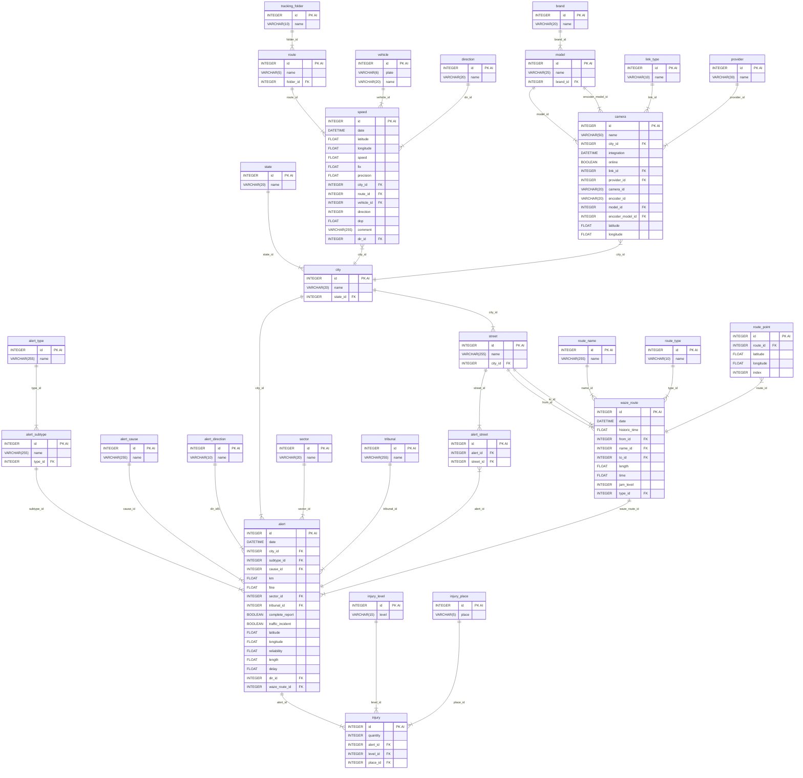
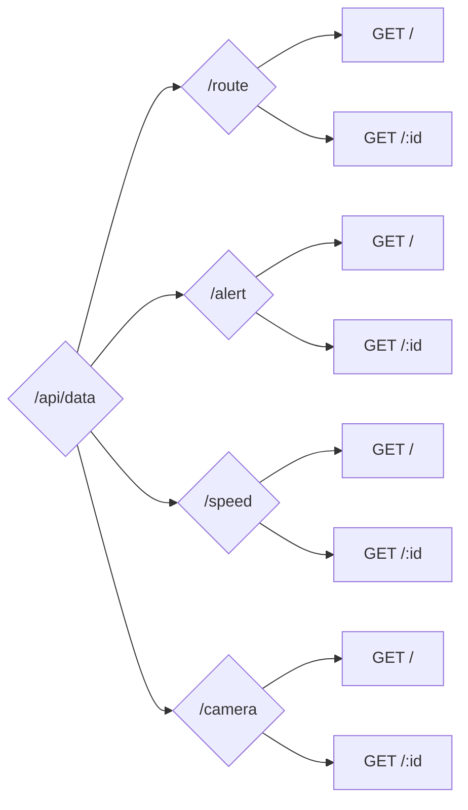

# Tablas de la Base de Datos

A continuación se muestran las diferentes tablas de la Base de Datos, donde se indican:

- Fuentes: Tablas de donde se obtendrían los datos
- Columnas: Nombre y tipo de dato

El Modelo Entidad Relación se encuentra en los [anexos](#modelo-entidad-relación).

## state

**Fuente(s)**:

- Siniestros buses interurbanos(1).xlsx
- Data accidentes de carabineros.xlsx
- Inventario CCTV Biobío(1).xlsx

**Columnas**:

- `id`: `INTEGER`, `PRIMARY KEY`, `AUTOINCREMENT`
- `name`: `VARCHAR(20)`

## city

**Fuente(s)**:

- Siniestros buses interurbanos(1).xlsx
- Data accidentes de carabineros.xlsx
- Inventario CCTV Biobío(1).xlsx
- Alertas de Tráfico.csv
- Copia de Accidentes.csv

**Columnas**:

- `id`: `INTEGER`, `PRIMARY KEY`, `AUTOINCREMENT`
- `name`: `VARCHAR(20)`
- `state_id`: `INTEGER`, `FOREIGN KEY` (`id` - [state](#state))

## sector

**Fuente(s)**:

- Siniestros buses interurbanos(1).xlsx
- Data accidentes de carabineros.xlsx

**Columnas**:

- `id`: `INTEGER`, `PRIMARY KEY`, `AUTOINCREMENT`
- `name`: `VARCHAR(20)`

## street

**Fuente(s)**:

- Siniestros buses interurbanos(1).xlsx
- Data accidentes de carabineros.xlsx
- Alertas de Tráfico.csv
- Copia de Accidentes.csv
- Waze for Cities Data Key Alerts Dashboard_Traffic Irregularities_Tabla(1).csv
- Red de Waze

**Columnas**:

- `id`: `INTEGER`, `PRIMARY KEY`, `AUTOINCREMENT`
- `name`: `VARCHAR(255)`
- `city_id`: `INTEGER`, `FOREIGN KEY` (`id` - [city](#city))

## tribunal

**Fuente(s)**:

- Data accidentes de carabineros.xlsx

**Columnas**:

- `id`: `INTEGER`, `PRIMARY KEY`, `AUTOINCREMENT`
- `name`: `VARCHAR(255)`

## alert_type

**Fuente(s)**:

- Siniestros buses interurbanos(1).xlsx
- Data accidentes de carabineros.xlsx
- Incidentes de tráfico radio.xlsx

**Columnas**:

- `id`: `INTEGER`, `PRIMARY KEY`, `AUTOINCREMENT`
- `name`: `VARCHAR(255)`

## alert_subtype

**Fuente(s)**:

- Siniestros buses interurbanos(1).xlsx
- Data accidentes de carabineros.xlsx
- Incidentes de tráfico radio.xlsx

**Columnas**:

- `id`: `INTEGER`, `PRIMARY KEY`, `AUTOINCREMENT`
- `name`: `VARCHAR(255)`
- `type_id`: `INTEGER`, `FOREIGN KEY` (`id` - [alert_type](#alert_type))

## alert_direction

**Fuente(s)**:

- Incidentes de tráfico radio.xlsx

**Columnas**:

- `id`: `INTEGER`, `PRIMARY KEY`, `AUTOINCREMENT`
- `name`: `VARCHAR(10)`

## alert_cause

**Fuente(s)**:

- Siniestros buses interurbanos(1).xlsx
- Data accidentes de carabineros.xlsx
- Waze for Cities Data Key Alerts Dashboard_Traffic Irregularities_Tabla(1).csv

**Columnas**:

- `id`: `INTEGER`, `PRIMARY KEY`, `AUTOINCREMENT`
- `name`: `VARCHAR(255)`

## route_name

**Fuente(s)**:

- Red de Waze

**Columnas**:

- `id`: `INTEGER`, `PRIMARY KEY`, `AUTOINCREMENT`
- `name`: `VARCHAR(255)`

## route_type

**Fuente(s)**:

- Red de Waze

**Columnas**:

- `id`: `INTEGER`, `PRIMARY KEY`, `AUTOINCREMENT`
- `name`: `VARCHAR(10)`

## waze_route

**Fuente(s)**:

- Red de Waze

**Columnas**:

- `id`: `INTEGER`, `PRIMARY KEY`, `AUTOINCREMENT`
- `date`: `DATETIME`
- `historic_time`: `FLOAT`
- `from_id`: `INTEGER`, `FOREIGN KEY` (`id` - [street](#street))
- `name_id`: `INTEGER`, `FOREIGN KEY` (`id` - [route_name](#route_name))
- `to_id`: `INTEGER`, `FOREIGN KEY` (`id` - [street](#street))
- `length`: `FLOAT`
- `time`: `FLOAT`
- `jam_level`: `INTEGER`
- `type_id`: `INTEGER`, `FOREIGN KEY` (`id` - [route_type](#route_type))

## route_point

**Fuente(s)**:

- Red de Waze

**Columnas**:

- `id`: `INTEGER`, `PRIMARY KEY`, `AUTOINCREMENT`
- `route_id`: `INTEGER`, `FOREIGN KEY` (`id` - [waze_route](#waze_route))
- `latitude`: `FLOAT`
- `longitude`: `FLOAT`
- `index`: `INTEGER`

## alert

**Fuente(s)**:

- Siniestros buses interurbanos(1).xlsx
- Data accidentes de carabineros.xlsx
- Incidentes de tráfico radio.xlsx
- Alertas de Tráfico.csv
- Copia de Accidentes.csv
- Waze for Cities Data Key Alerts Dashboard_Traffic Irregularities_Tabla(1).csv
- Red de Waze

**Columnas**:

- `id`: `INTEGER`, `PRIMARY KEY`, `AUTOINCREMENT`
- `date`: `DATETIME`
- `city_id`: `INTEGER`, `FOREIGN KEY` (`id` - [city](#city))
- `subtype_id`: `INTEGER`, `FOREIGN KEY` (`id` - [alert_subtype](#alert_subtype))
- `cause_id`: `INTEGER`, `FOREIGN KEY` (`id` - [alert_cause](#alert_cause))
- `km`: `FLOAT`
- `fine`: `FLOAT`
- `sector_id`: `INTEGER`, `FOREIGN KEY` (`id` - [sector](#sector))
- `tribunal_id`: `INTEGER`, `FOREIGN KEY` (`id` - [tribunal](#tribunal))
- `complete_report`: `BOOLEAN`
- `traffic_incident`: `BOOLEAN`
- `latitude`: `FLOAT`
- `longitude`: `FLOAT`
- `reliability`: `FLOAT`
- `length`: `FLOAT`
- `delay`: `FLOAT`
- `dir_id`: `INTEGER`, `FOREIGN KEY` (`id` - [alert_direction](#alert_direction))
- `waze_route_id`: `INTEGER`, `FOREIGN KEY` (`id` - [waze_route](#waze_route))

## injury_level

**Fuente(s)**:

- Siniestros buses interurbanos(1).xlsx

**Columnas**:

- `id`: `INTEGER`, `PRIMARY KEY`, `AUTOINCREMENT`
- `level`: `VARCHAR(15)`

## injury_place

**Fuente(s)**:

- Siniestros buses interurbanos(1).xlsx

**Columnas**:

- `id`: `INTEGER`, `PRIMARY KEY`, `AUTOINCREMENT`
- `place`: `VARCHAR(5)`

## injury

**Fuente(s)**:

- Siniestros buses interurbanos(1).xlsx
- Waze for Cities Data Key Alerts Dashboard_Traffic Irregularities_Tabla(1).csv

**Columnas**:

- `id`: `INTEGER`, `PRIMARY KEY`, `AUTOINCREMENT`
- `quantity`: `INTEGER`
- `alert_id`: `INTEGER`, `FOREIGN KEY` (`id` - [alert](#alert))
- `level_id`: `INTEGER`, `FOREIGN KEY` (`id` - [injury_level](#injury_level))
- `place_id`: `INTEGER`, `FOREIGN KEY` (`id` - [injury_place](#injury_place))

## alert_street

**Fuente(s)**:

- Siniestros buses interurbanos(1).xlsx
- Data accidentes de carabineros.xlsx
- Alertas de Tráfico.csv
- Copia de Accidentes.csv
- Waze for Cities Data Key Alerts Dashboard_Traffic Irregularities_Tabla(1).csv
- Red de Waze

**Columnas**:

- `id`: `INTEGER`, `PRIMARY KEY`, `AUTOINCREMENT`
- `alert_id`: `INTEGER`, `FOREIGN KEY` (`id` - [alert](#alert))
- `street_id`: `INTEGER`, `FOREIGN KEY` (`id` - [street](#street))

## tracking_folder

**Fuente(s)**:

- DTPR

**Columnas**:

- `id`: `INTEGER`, `PRIMARY KEY`, `AUTOINCREMENT`
- `name`: `VARCHAR(10)`

## route

**Fuente(s)**:

- DTPR

**Columnas**:

- `id`: `INTEGER`, `PRIMARY KEY`, `AUTOINCREMENT`
- `name`: `VARCHAR(5)`
- `folder_id`: `INTEGER`, `FOREIGN KEY` (`id` - [tracking_folder](#tracking_folder))

## vehicle

**Fuente(s)**:

- DTPR
- Med velo CHIGUAYANTE.xlsx
- Med velo LA VEGA.xlsx

**Columnas**:

- `id`: `INTEGER`, `PRIMARY KEY`, `AUTOINCREMENT`
- `plate`: `VARCHAR(6)`
- `name`: `VARCHAR(20)`

## direction

**Fuente(s)**:

- Med velo CHIGUAYANTE.xlsx
- Med velo LA VEGA.xlsx

**Columnas**:

- `id`: `INTEGER`, `PRIMARY KEY`, `AUTOINCREMENT`
- `name`: `VARCHAR(20)`

## speed

**Fuente(s)**:

- GH026929.xlsx
- DTPR
- Med velo CHIGUAYANTE.xlsx
- Med velo LA VEGA.xlsx

**Columnas**:

- `id`: `INTEGER`, `PRIMARY KEY`, `AUTOINCREMENT`
- `date`: `DATETIME`
- `latitude`: `FLOAT`
- `longitude`: `FLOAT`
- `speed`: `FLOAT`
- `fix`: `FLOAT`
- `precision`: `FLOAT`
- `city_id`: `INTEGER`, `FOREIGN KEY` (`id` - [city](#city))
- `route_id`: `INTEGER`, `FOREIGN KEY` (`id` - [route](#route))
- `vehicle_id`: `INTEGER`, `FOREIGN KEY` (`id` - [vehicle](#vehicle))
- `direction`: `INTEGER`
- `dop`: `FLOAT`
- `comment`: `VARCHAR(255)`
- `dir_id`: `INTEGER`, `FOREIGN KEY` (`id` - [direction](#direction))

## brand

**Fuente(s)**:

- Inventario CCTV Biobío(1).xlsx

**Columnas**:

- `id`: `INTEGER`, `PRIMARY KEY`, `AUTOINCREMENT`
- `name`: `VARCHAR(20)`

## model

**Fuente(s)**:

- Inventario CCTV Biobío(1).xlsx

**Columnas**:

- `id`: `INTEGER`, `PRIMARY KEY`, `AUTOINCREMENT`
- `name`: `VARCHAR(25)`
- `brand_id`: `INTEGER`, `FOREIGN KEY` (`id` - [brand](#brand))

## link_type

**Fuente(s)**:

- Inventario CCTV Biobío(1).xlsx

**Columnas**:

- `id`: `INTEGER`, `PRIMARY KEY`, `AUTOINCREMENT`
- `name`: `VARCHAR(10)`

## provider

**Fuente(s)**:

- Inventario CCTV Biobío(1).xlsx

**Columnas**:

- `id`: `INTEGER`, `PRIMARY KEY`, `AUTOINCREMENT`
- `name`: `VARCHAR(30)`

## camera

**Fuente(s)**:

- Inventario CCTV Biobío(1).xlsx

**Columnas**:

- `id`: `INTEGER`, `PRIMARY KEY`, `AUTOINCREMENT`
- `name`: `VARCHAR(50)`
- `city_id`: `INTEGER`, `FOREIGN KEY` (`id` - [city](#city))
- `integration`: `DATETIME`
- `online`: `BOOLEAN`
- `link_id`: `INTEGER`, `FOREIGN KEY` (`id` - [link_type](#link_type))
- `provider_id`: `INTEGER`, `FOREIGN KEY` (`id` - [provider](#provider))
- `camera_id`: `VARCHAR(20)`
- `encoder_id`: `VARCHAR(20)`
- `model_id`: `INTEGER`, `FOREIGN KEY` (`id` - [model](#model))
- `encoder_model_id`: `INTEGER`, `FOREIGN KEY` (`id` - [model](#model))
- `latitude`: `FLOAT`
- `longitude`: `FLOAT`

# Endpoints de la API

A continucación, se muestran los diferentes endpoints que podría tener la API, la estructura está en los [anexos](#estructura-de-la-api)

## `USE /route`

### `GET /`

Obtener un conjunto de rutas de Waze

**Queries**:

- `?token`: Token
- `?min_date`: Fecha mínima (por defecto = Ahora - 1 día)
- `?max_date`: Fecha máxima (por defecto = Ahora)
- `?min_lat`: Latitud mínima
- `?max_lat`: Latitud máxima
- `?min_lng`: Longitud mínima
- `?max_lng`: Longitud máxima

**Response**:

- [`WazeRouteGroup`](#tipos-de-typescript)

### `GET /:id`

Obtener una ruta de Waze en específico

**Queries**:

- `?token`: Token

**Params**:

- `/:id`: ID de la ruta de waze

**Response**:

- [`WazeRoute`](#tipos-de-typescript)

## `USE /alert`

### `GET /`

Obtener un conjunto de alertas o accidentes

**Queries**:

- `?token`: Token
- `?min_date`: Fecha mínima (por defecto = Ahora - 1 día)
- `?max_date`: Fecha máxima (por defecto = Ahora)
- `?min_lat`: Latitud mínima
- `?max_lat`: Latitud máxima
- `?min_lng`: Longitud mínima
- `?max_lng`: Longitud máxima
- `?state`: Región
- `?city`: Ciudad
- `?type`: Tipo de alerta/accidente
- `?subtype`: Subtipo de alerta/accidente
- `?min_km`: Kilómetro mínimo
- `?max_km`: Kilómetro máximo
- `?min_fine`: Parte mínimo
- `?max_fine`: Parte máximo
- `?sector`: Sector
- `?tribunal`: Tribunal
- `?complete_report`: Reporte Completo (`0` o `1`)
- `?traffic_incident`: Accidente de tráfico (`0` o `1`)
- `?min_rel`: Confiabilidad Mínima (entre `5` y `10`)
- `?max_rel`: Confiabilidad Máxima (entre `5` y `10`)
- `?min_len`: Largo mínimo
- `?max_len`: Largo máximo
- `?min_del`: Desfase mínimo
- `?max_del`: Desfase máximo
- `?dir`: Dirección (`N-S`, `S-N`, etc)

**Response**:

- [`AlertGroup`](#tipos-de-typescript)

### `GET /:id`

Obtener una alerta o accidente en específico

**Queries**:

- `?token`: Token

**Params**:

- `/:id`: ID de la alerta o accidente

**Response**:

- [`Alert`](#tipos-de-typescript)

## `USE /speed`

### `GET /`

Obtener un conjunto de medidas de velocidad

**Queries**:

- `?token`: Token
- `?min_date`: Fecha mínima (por defecto = Ahora - 1 día)
- `?max_date`: Fecha máxima (por defecto = Ahora)
- `?min_lat`: Latitud mínima
- `?max_lat`: Latitud máxima
- `?min_lng`: Longitud mínima
- `?max_lng`: Longitud máxima
- `?min_spd`: Velocidad mínima
- `?max_spd`: Velocidad máxima
- `?min_fix`: Fix mínimo
- `?max_fix`: Fix máximo
- `?min_pres`: Presición mínima
- `?max_pres`: Presición máxima
- `?state`: Región
- `?city`: Ciudad
- `?folder`: Carpeta de la ruta
- `?route`: Ruta
- `?vh_type`: Tipo de vehículo
- `?plate`: Patente del vehículo
- `?direction`: Dirección (`-1`, `0` o `1`)
- `?min_dop`: Presión geométrica mínima
- `?max_dop`: Presión geométrica máxima

**Response**:

- [`SpeedGroup`](#tipos-de-typescript)

### `GET /:id`

Obtener una medida en específico

**Queries**:

- `?token`: Token

**Params**:

- `/:id`: ID de la medida

**Response**:

- [`Speed`](#tipos-de-typescript)

## `USE /camera`

### `GET /`

Obtener un conjunto de cámaras

**Queries**:

- `?token`: Token
- `?min_int`: Fecha de integración mínima
- `?max_int`: Fecha de integración máxima
- `?min_lat`: Latitud mínima
- `?max_lat`: Latitud máxima
- `?min_lng`: Longitud mínima
- `?max_lng`: Longitud máxima
- `?state`: Región
- `?city`: Ciudad
- `?online`: Estado de la cámara (`0` o `1`)
- `?link`: Tipo de enlace
- `?prov`: Proveedor
- `?brand`: Marca de la cámara
- `?model`: Modelo de la cámara
- `?enc_brand`: Marca del codificador de video
- `?enc_model`: Modelo del codificador de video

**Response**:

- [`CameraGroup`](#tipos-de-typescript)

### `GET /:id`

Obtener una cámara en específico

**Queries**:

- `?token`: Token

**Params**:

- `/:id`: ID de la medida

**Response**:

- [`Camera`](#tipos-de-typescript)

# Anexos

## Modelo Entidad Relación

[preview](https://mermaid.live/edit#pako:eNqtWFFv2zYQ_isCnzYgCezGlhK9ea27Be2aIgv6UBgwGIm22UikRlNZ3MT_fRQpKhRFppEtv8TmHY93R9539-UJJDRFIAaIfcBwzWC-IIH4bDnkKHhSP6rP1Zfb-Z_zmwCnwQJ8_RTMrhbgRfptdvP-r9nNb-9GvwcE5khJ9guiviSY7441Zu6T3i3F7o-frJO2KOGUDeb4ljOE-AHmplOf71UunK5zhu9KArOjT2sswgwxvuS7Ag1tc1veDWLW3FgZdCZGHZliJu4WU9L_0PHolVASWG4HzA-jpXialWBom4cl3BP7f_AnWkq7bzf5YXY7v736ex6kovpelj9-vp7dBhu8FYWHkyXHrstdMZqbl2vKKvd8Mk5tiTouQ2TNN_aq--wfMF9m6AFlPd6cSnlBMelR_VqqNrv9hhzzMu2kL6NkbQmas0iKHl1P9-ib80FSC2pVpfvEsnrcod7n9soKExeYS8j2PoAaFW35H9fXn-ezL0FC8yJDIt0MFZTxrgJncLUS7xKTBKeI8CNuRAkYyjC8w5lI2tteZYoyuOtGJgDNF_RLdTofJyY_SrZTb_oARBAgY5SDbbXIYHIAzgijcqfTaP8S-reEhLcyrCUKtT2Jk3H5hNK_VzpM32b_Jo-UUU_Dh8k9JuvlimYpYoNhe09YN27Q3ZiVe84QHtAGJ9kBh4XyuZhg9ItJ7Ij275vtCoTSgbpfbxCRh3fx8dFeKkTUeCvC7ofazg6khfWl-cRNpjs4RgvPzCJAOG9BqwfjmtzfMUjSwW4yFxTmoLHZ9-Kle07HM0zuh53ECkYf8EHlf-4hW2KJwQPqf_RWytIqBzEhIcEb2w9GN19KMmfPl2n0wXSdEFtuPgIVo9BwixGpWC1rybV5-Vh8Z-uNTqVepW5QyIpJPz-fnj4_KSIcN_zVYMe1Qt2DYp1zE6r2lcqzttEodLhebarN1GI967ponLmjcq-Z-bpEyVLV85-bqVnKCg3-6UbdWGvHVJN52zs9L1q02VIzBkeLzbfzoxPeNGqXrkGXYs1lfqknuYtjwKjvUTuqxwdzsq_N1dOTqeOYAG1lPQQ5xjpbVY9EDvbqiqhmah1W6ozefEEmnarDbynrftUhp9altgbjFty9Whz2pFVbbS5UDzjm_KQLUpae7aGeeyyll87aHVssVVULZjesFVQzi5seZLY4jSIq5LjBstd0bEjrdjJ7Rw3OVnuytQyYBidgzcSfmLMSnQChkMPqJ5A9aAH4Bom2AmLxNYXsvmo-e7GngOQ7pbneJjK83oB4BbOt-FUW1ZxV_0-yUUGCC7P3tCQcxBcXk4k0AuIn8Aji03B0Np1EF5eTcTiJJtE4PAE7sTwOz8_C6TSaXoajy2g8mkb7E_BTHjw-m46jyzB8F40mkzCKovP9_5fxGAk)



## Estructura de la API

[preview](https://mermaid.live/edit#pako:eNptkD1vwyAURf-K9YZOTgw2BpuhS1t16VR1ap2BhhfbavwhjNUP5P9enMRNI4WJA-dexHOw7TSChN2--9xWytjg6bloA7_e1YAuUn0daWXVFKxWt8eLcUDiItONFqfgZkbqvT0ae8LYRUOPqE-YuGirGjRqOufntqBES8jb48NLEG28OiM9oqz15k-mi0wvZXpNjhc5vpTja3KyyMmlnPyTIYTS1BqkNSOG4P_RqBnBzTUF2AobLED6rVbmo4CinXymV-1r1zVLzE-rrEDu1H7wNPZ-pHhfq9Kos4KtRnPXja0FmWUsO5SAdPAFcsXJOmUiyxnlTDBBeQjf_pjyZM3TVKQ5J7mgJBVTCD-Hh-k6pSLnPBaEMS6ESKZfi86RHw)



## Tipos de Typescript

```typescript
export interface IdName {
  id: number;
  name?: string;
}

export interface Position {
  latitude: number;
  longitude: number;
}

export interface City extends IdName {
  state: IdName;
}

export interface Street extends IdName {
  city: City;
}

export interface WazePoint extends Position {
  id: number;
  index: number;
}

export interface WazeRoute {
  id: number;
  date: Date;
  historicTime: number;
  from: Street;
  name: IdName;
  to: Street;
  length: number;
  time: number;
  jamLevel: number;
  type: IdName;
  points: WazePoint[];
}

export interface AlertSubtype extends IdName {
  type: IdName;
}

export interface Injury {
  level: IdName;
  place: IdName;
}

export interface Alert extends Partial<Position> {
  id: number;
  date: Date;
  city?: City;
  subtype?: AlertSubtype;
  cause?: IdName;
  km?: number;
  fine?: number;
  sector?: IdName;
  tribunal?: IdName;
  completeReport?: boolean;
  trafficIncident?: boolean;
  reliability?: number;
  length?: number;
  delay?: number;
  dir?: IdName;
  wazeRoute?: WazeRoute;
  injuries?: Injury[];
}

export interface Route extends IdName {
  folder: IdName;
}

export interface Vehicle extends IdName {
  plate: string;
}

export interface Speed extends Position {
  id: number;
  date: Date;
  speed: number;
  fix?: number;
  precision?: number;
  city?: City;
  route?: Route;
  vehicle?: Vehicle;
  direction?: number;
  dop?: number;
  comment?: string;
  dir?: IdName;
}

export interface Model extends IdName {
  brand: IdName;
}

export interface Camera extends IdName, Position {
  city: City;
  integration: Date;
  online: boolean;
  link: IdName;
  provider: IdName;
  camId: string;
  encoderId?: string;
  model: Model;
  encoderModel?: Model;
}

export interface Stats<T> {
  count: number;
  mean: T;
  logMean: T;
  median: T;
  stdDev: T;
  logStdDev: T;
  min: T;
  max: T;
  NAs: number;
}

export interface CatStats<T> {
  total: number;
  categories: [T | undefined, number][];
}

export interface PositionGroup {
  latitude: Stats<number>;
  longitude: Stats<number>;
}

export interface WazeRouteGroup {
  date: Stats<Date>;
  historicTime: Stats<number>;
  from: CatStats<Street>;
  name: CatStats<IdName>;
  to: CatStats<Street>;
  length: Stats<number>;
  time: Stats<number>;
  jamLevel: Stats<number>;
  type: CatStats<IdName>;
  wazeRoutes: WazeRoute[];
}

export interface AlertGroup extends Partial<PositionGroup> {
  date: Stats<Date>;
  city: CatStats<City>;
  state: CatStats<IdName>;
  subtype: CatStats<AlertSubtype>;
  type: CatStats<IdName>;
  cause: CatStats<IdName>;
  km: Stats<number>;
  fine: Stats<number>;
  sector: CatStats<IdName>;
  tribunal: CatStats<IdName>;
  completeReport: CatStats<boolean>;
  trafficIncident: CatStats<boolean>;
  reliability: Stats<number>;
  length: Stats<number>;
  delay: Stats<number>;
  dir: CatStats<IdName>;
  alerts: Alert[];
}

export interface SpeedGroup extends PositionGroup {
  date: Stats<Date>;
  speed: Stats<number>;
  fix: Stats<number>;
  precision: Stats<number>;
  city: CatStats<City>;
  state: CatStats<IdName>;
  route: CatStats<Route>;
  folder: CatStats<IdName>;
  vehicle: CatStats<Vehicle>;
  direction: CatStats<number>;
  dop: Stats<number>;
  dir: CatStats<IdName>;
  speeds: Speed[];
}

export interface CameraGroup extends PositionGroup {
  city: CatStats<City>;
  state: CatStats<IdName>;
  integration: Stats<Date>;
  online: CatStats<boolean>;
  link: CatStats<IdName>;
  provider: CatStats<IdName>;
  model: CatStats<Model>;
  brand: CatStats<IdName>;
  encoderModel: CatStats<Model>;
  encoderBrand: CatStats<IdName>;
  cameras: Camera[];
}
```
