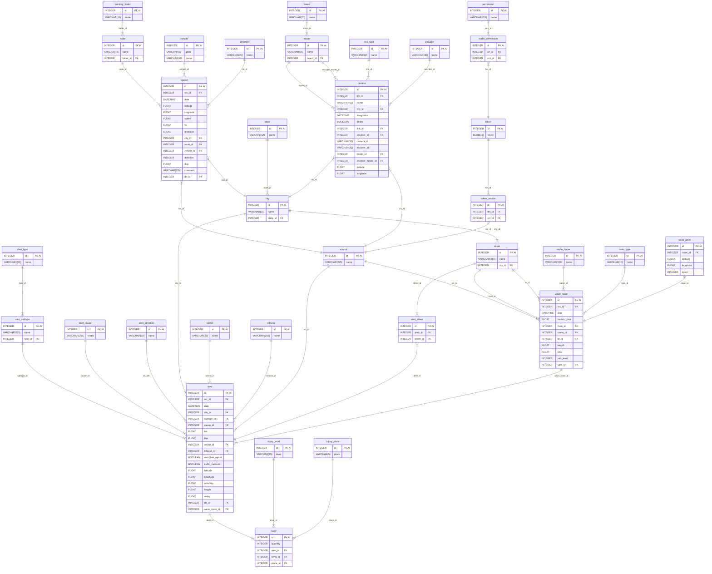
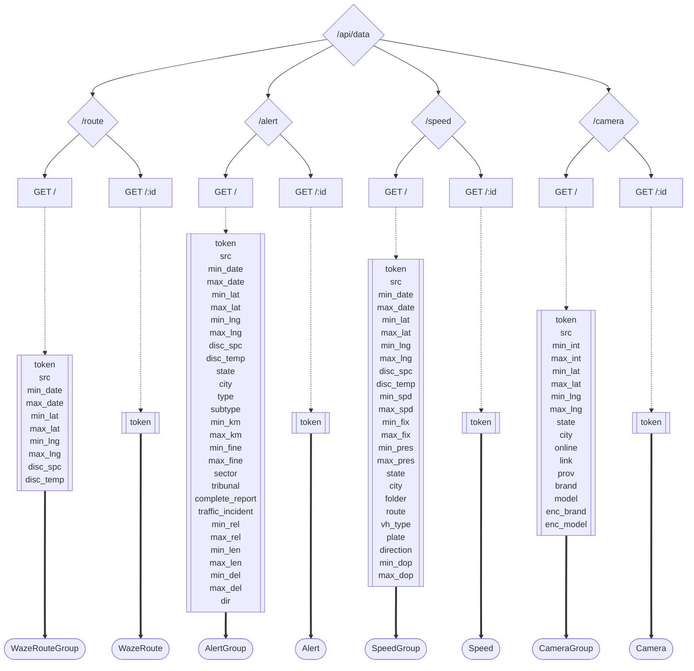

# Introducción

Este documento explica cómo está organizada la información y cómo se puede consultar la base de datos del sistema. Este sistema se encarga de registrar y gestionar datos sobre el movimiento en la ciudad, tales como accidentes, alertas de tráfico, velocidad de los vehículos, rutas y cámaras de vigilancia.

# Información Almacenada (Tablas)

A continuación, se describen las categorías de datos que guarda el sistema y de dónde proviene esa información.

## Identificación y Permisos

- **token:** Contiene las claves de seguridad únicas para acceder al sistema.
- **source (Fuentes):** Lista los nombres de todos los archivos y entidades que entregan datos (ej. Waze, Carabineros, archivos de Excel de mediciones de velocidad, etc.).
- **permission (Permisos):** Define qué acciones se pueden realizar en el sistema.
- **Relaciones de acceso:** Existen listas que vinculan cada clave de seguridad con sus fuentes de datos y permisos permitidos.

## Ubicación Geográfica

- **state (Región/Estado):** Nombre de la región.
- **city (Comuna/Ciudad):** Nombre de la ciudad y a qué región pertenece.
- **sector:** Nombre del sector específico dentro de una zona.
- **street (Calle):** Nombre de las calles y la ciudad donde se ubican.

## Alertas y Accidentes

- **alert_type y alert_subtype:** Clasifican el tipo de incidente (ej. "Accidente" y el subtipo "Choque por alcance").
- **alert_direction:** Indica hacia dónde se dirige el tráfico en el lugar del incidente (ej. Norte-Sur).
- **alert_cause:** Describe el motivo del incidente.
- **alert:** Es el registro principal donde se junta toda la información: fecha, ubicación exacta (latitud y longitud), ciudad, tipo de alerta, confiabilidad del reporte y si hubo retrasos en el tráfico.
- **tribunal:** Indica a qué juzgado o tribunal pertenece el caso, si aplica.

## Consecuencias y Daños

- **injury_level (Nivel de lesión):** Gravedad de las lesiones.
- **injury_place (Lugar de atención):** Dónde se atendió a los afectados.
- **injury (Lesiones):** Registra cuántas personas resultaron afectadas en una alerta específica y su gravedad.

## Información de Carreteras y Rutas (Waze)

- **route_name:** Nombre de la ruta.
- **route_type:** Tipo de vía.
- **waze_route:** Información detallada de un trayecto: fecha, tiempo histórico que toma recorrerla, tiempo actual, nivel de congestión y largo de la ruta.
- **route_point:** Los puntos exactos en el mapa que dibujan el recorrido de la ruta.

## Monitoreo de Velocidad y Vehículos

- **vehicle:** Registra la patente y nombre de los vehículos monitoreados.
- **direction:** Sentido en el que se mueve el vehículo.
- **speed (Velocidad):** Registra la velocidad exacta en un momento y lugar determinado, incluyendo qué vehículo era y en qué ruta se encontraba.

## Cámaras de Vigilancia

- **brand y model:** Marca y modelo de la cámara y de sus equipos de transmisión.
- **link_type:** Tipo de conexión que utiliza la cámara.
- **provider:** Empresa que provee el servicio de la cámara.
- **camera:** Registro completo de la cámara: nombre, si está funcionando (online), fecha en que se instaló y su ubicación en el mapa.

# Cómo Consultar la Información (Puntos de Acceso)

El sistema permite pedir información específica mediante consultas. Para todas se requiere una clave de seguridad (**token**).

## 1. Consulta de Rutas

Se puede pedir una lista de trayectos o uno en específico usando su número de identificación.

- **Filtros disponibles:** Se puede buscar por fechas, por un área específica en el mapa (coordenadas) o por la fuente que entregó el dato.

## 2. Consulta de Alertas y Accidentes

Permite buscar incidentes detallados.

- **Filtros disponibles:** Además de fechas y ubicación, se puede filtrar por ciudad, tipo de accidente, si el reporte está completo, si hubo heridos, el nivel de retraso del tráfico o la dirección del vehículo.

## 3. Consulta de Velocidades

Permite revisar las mediciones de rapidez capturadas.

- **Filtros disponibles:** Se puede buscar por vehículo (patente), rango de velocidad, ruta específica o por la precisión del equipo de medición.

## 4. Consulta de Cámaras

Permite ver el inventario de cámaras instaladas.

- **Filtros disponibles:** Se puede saber cuáles están funcionando (online), de qué marca son, quién es el proveedor o en qué ciudad se encuentran.

# Anexos

## Mapa de Relaciones (Modelo Entidad Relación)

Este diagrama muestra cómo se conectan todas las piezas de información entre sí (por ejemplo, cómo una calle está conectada a una ciudad y una ciudad a una región).

[Ver modelo de conexión de datos](https://mermaid.live/edit#pako:eNq9Wd1T4zYQ_1cyfrqbgRsSJyH4LdzlWubo0aFMHzqZyQhbCbrYkivLlBzkf6-sD0eWZYOD27yQSKvVfmn3t8uzF5IIeoEH6RcENhQkSzzgH0a2EA-e5Y_ic_X9bvHL4naAosHS-_3bYH619A67l9c3lx-G04_ynFzfL9WXjOQ0hG9n9uf89vOv89sPo8nk4wCDBFr8UkgTlGWI4P54CrlXXSXVu2yLV4Li6zfXdkZDe9u6-BiV3nh5SpPGyzMG2DGOOXPaMERs915mFbMV0jXLDkNGaG_CZ4xCyN4dUObBwh7NfqfoPscg7i-EQQwpW7FdCvvmmeX3vbCtRC1n2GgceW2EKPfxUc98eNaiTgjyrEcbUZLzMC02-uZ5nNEbdP8H_IQrwbd7inEksOLzZX63uLv6bTGI-EM9LH-9vpnfDR5Qxt8nClcMufy_piRpS1uFBm37jLh25dUxxBv2YK-65fgBklUMH2HcMUSlh1KCMOtuT3m4WX7AEMujmkljgjfWRnkfjuCTK9r_a2e3JbsKV5lD2kjEu2y2yjaxV9YIu8qGKAytsaNyr4vm8ubmejH_PghJksaQe4nClFBWJ2AUrNc8vBEOUQQxe4cT5QaFMQL3KOaGfFtARzAGu7p2PG22KX_IA42xjfCPnO7kszgi__CUZrwom2sag2PAIGcqTjqZdg_yv3OAWcXSekfWiBYDCt1aEVch5yu1rSvceLN0knEL7ADhFuHNak3iCNLeqkvHwmJ41Q0PpHiNajzCBxTGR1w4FWFkJrBXcOE7QEgT0kwhjP6fGtw5BwnZ6mn2yV5KuVFQ0a50LwSNtU8TKN-2kZROqaVEkjaALJ7Pk0qWbkmXpavuKcBRb45PeKd9FN5veiRCvEbhY4S3_ULIlJJHdFTW8Bs6Rr5EQW9vocwqZ11assor4nAObiioxpYu-QTHTsQhLN3agku7tclcxIw0B6dyb0NczGpoZV9fIWKrTQZ9uJGwU8awYvrl5fT05Vm7MyilaaOxBarMihTxAasEyudmCt0XRC9y7BBo15qDDX2lJNDjBGNYoQhUMbZ4GP20oqt2w4FuEFytsnmiuLtEv_VG1CLVKNjdCVvEMnn9UVep5FaxihyZ2LJpvGwNJiwyAzS7XCXILC9Js1aNp01d4hQXrdGrBrpTfJVOdIQOjKXCROuhEZTZIyl2CkzaNBU4bJNqNOjAuDapxoW1sYFLG9X_1sYBTs3N0DIbU6V6hVjX39pUwPJ3pU-opOuWd2fDS8WzdKVGdSZo1I9QvGlbPg30LKIDRrBRmkUoH4gja8jorQasLPeKg8xaQVlk7aJq5zNVBKxKaVMZpcBlU5dUchSvGJlz6kCNfh0T7NfYmQNnRSvWqywNosr1h_VAjZe9E29D-Z-A0RyeeFylBBQ_PVHalx57gLwcewH_GgG6LerOnp9JAf6LkEQf467fPHjBGsQZ_5WnBaRV_5UoSSDm1vtMcsy8YHgxmwgmXvDsPXnB6Wg4_jS9GA2nI394MZ7MTrwdXx3y1dn5ZOyP_enYP7sY-_sT76e4d_Rp6I_PZ5Ph-cQf-ePZ1N__CyklP5o)



## Flujo de Consultas

Este diagrama muestra los pasos para solicitar información al sistema.

[Ver cómo funciona la búsqueda](https://mermaid.live/edit#pako:eNrNVV1r2zAU_StGD2OFfEnK4tjQwmhH37fCYE0Iiq0kIrakyXKX1OS_V_KXlC4Z7GnLk47vOVf33nPtVCARKQUx2GTiV7IjSgdPDwsemN-aFLQaE8nGKdHkFAyHd02gLOikGitRanoKPlgIDS-jSrcQVeNCUpq2EFfjhORUkZPT22zBlurJ5Pnxy1MwXhqqhbCBMUuXPRl2ZHhOhpfIqCOjczK6RMYdGZ-T8W_kutRgODL0nyVVR1P38wJosae8IRQqaQ454yszMNoicvCRiWVEu5ADNsK3XqQDKSuSVSETD2maywVYLoPb27tA0UJOJh-fv5NX-tV68mickcsbVzf064au7rMM0MvgiaHfNPznTTe36j53wvSxOemjbJ8V5doBe8U-dzf0Z_N8w7hXsEMFTbRQbVrF1iUnWXudyGVGNV0pKoXSHYVsNixZMZ6wlHKvN0Uzl98B23U3wbrrHtgp-poepEyd2QWN4Z_tG_febOibDa-YDWGr9oTINxr9H0ZbWSFTJ3Ogtu_gu3dwEWmadCGHLi7ORmQpbd2uv2nN8WW3clsks15onDDrwYRvmZDeOMT5q4mMU9_sx_C9U8h3Cl1xCsFW7Qmx7xT-o1OMe24wfzX_1qeLoxM8618ac9q3w1Lipf0HUYR3hol-lylPVl7EwibqN47N2O7rP433c8P-3PCVuWHYyZc3YAC2iqUg1qqkA2Ae5sRCUNmcRr2jOV2A2BxTovYLsOAno5GE_xAi72Smiu0OxBuSFQaV0q79AyNbRRyFcrNJ96LkGsRoEs3rJCCuwAHEEM1GeBrBT1GEZ1MUQTQARxAPw_loOpuGEUYhnqIwRKcBeK3vhSM4xXgWzmYRxtE8nIenN92QY-g)



## Estructura Técnica de los Objetos

Para los desarrolladores, el sistema utiliza un formato de datos llamado **TypeScript**. Esto asegura que la información de rutas, alertas, velocidades y cámaras siempre tenga la misma estructura y no falten datos importantes.

[Ver diagrama técnico de objetos](https://mermaid.ai/play?utm_medium=toggle&utm_source=mermaid_live_editor#pako:eNqtWF1v3CoQ_StoH6-6f6CKuupNpKtIN23URO1DkgfWZje0Nqwwmyb98G-_YMMwAzi3avqS2OcMA8wMc_B-XzW6FavXq6bjw3Am-d7w_lYxNr2z8_Yd7wX77hHG1LHfCsNkO78O1ki13zDlTDzy81alkZd6kFZqlY3tuJX22AoKarUHlHg5lfYpeghrGSy3peGVNULYaDoNa9yfwu4T_yYutVR2YU_xVbXisTr4gz7apYDEFeqjacIOz9xiWRtWDAPu5WC1kc217AMR1r8zuie-YmzBwmoaOqH29p5AFpwG4DPv_xUPoiOO7dMhWEFIbu7Ywf8fio2_7YSxV8etH5SlI_oh9ufq89HkieuKNRw63oj6ZL8dYZ_6DeSekaVv2DA_YGfOmB8HErEN-9LT951U2aBBNC6FFHPnYXtUPGxyq3UnuHL-dX_ohBUfxEEbm5HW8N1ONueqka1Qlk5rRCf5Vnawm0iUad-wVnT8iS6olSbleKrcDfsaH4PplCqXeukfpCiTTyo-JGCnu1aYwvSjuJdNB8Zzg_Bprp3YgxDtSw_S4J3kqXqkwMGIRg6uFdULJITFpJCEXWzYw_yQhVk6fxbcAawPtCu6rPeQ0LChkA8ShwvXf7ssvFvDVVs2Q0cZnrdDFCPS9kLI3HkWrqenBYfKY1p1WVEzB3yhB9ToBxkSDelseH-eKYBQXkVMhOct9f4vAsDsIhJZB-d2GK9HWhGNPsYYXrNeKnh0W4jPnd5foNdetDK9DbY9Ew_I9IoAPSfVwt69HSpxt_XFWW3jYb-5fhXQO3eWGhf5va6epqiL_7iCO8Rczu7n8WOmkRm3KJVwxIlnWPuc0ZHUy8z4MhnR0aITllIFLmdFGpFoFbMl-SpGRSHL9ocaG2Us0kqMU3V730s70lC8YrerVg6NEVZ-Ey2Qw-1qvLnzB7rG0bbp7b4SspSsl8YdhvhjPKJzXPqy5SCscyPVuWL8MxTSQhrmqIgUTbpYLhIJZLkCopRAh940ViWztKpqJ11goaC_Wm5ITYvVg6xO1ZaSn1XaRFSqLODpeuJ5DmCpkn_2RCPNzJP5WINz_XxRmU4HaMRqWwxLdwtEBk0eqSYDDVmj4pyRUaL_J6Ep5llCJ6KS0IDPU_pnz0OYKxr-6wn9rWjjKij0vzxG-CZQuE13goKitwOgJ3kfsfwXI-F-Uw7L7wiV0cHkb-zER3USXv-Aoh4Hs_X6LwZOCTq7LeCPqdAIDndngp6GxBAQ9-SCnHXQw_RKsF7rOYEldfJjvcYVtGCR6nfBgOrjglFqa95gXrcu508EnTbh5WyJo5Pgw-HDcArZLBkLMULim1PZnSinUXOdoh5PbIY_M9n0ujDTJ_yhFe7u6_WPNxBsj89X5QnGdZiMK6iug1Dd8NNLyuNrdsmNlbzCw-d_SUFApg8LXUUgAskGCjv8ZEGKwOPzFyXxF78cCRi-Qjw2f6ZmIHGKcHCQfu0pzeefKMgW0u87BA6ep5DUpsuxyRC1DwzHPoGGZ1BKGuocyHyBmhMGoSe_2KDdeO7kxIuC2fFGvMEFRnFcpZSJC6ZompvipL5KCoJHqXyX2ZqhGiqjSnhhDpSibCuxfigMBywLB3SpPCChZ-TmdoEhTfiZaC3wtJdWdjRxq5__Aa-KheI)


```typescript
export interface IdName {
  id: number;
  name?: string;
}

export interface Position {
  latitude: number;
  longitude: number;
}

export interface City extends IdName {
  state: IdName;
}

export interface Street extends IdName {
  city: City;
}

export interface WazePoint extends Position {
  id: number;
  index: number;
}

export interface WazeRoute {
  id: number;
  source: IdName;
  date: Date;
  historicTime: number;
  from: Street;
  name: IdName;
  to: Street;
  length: number;
  time: number;
  jamLevel: number;
  type: IdName;
  points: WazePoint[];
}

export interface AlertSubtype extends IdName {
  type: IdName;
}

export interface Injury {
  level: IdName;
  place: IdName;
}

export interface Alert extends Partial<Position> {
  id: number;
  source: IdName;
  date: Date;
  city?: City;
  subtype?: AlertSubtype;
  cause?: IdName;
  km?: number;
  fine?: number;
  sector?: IdName;
  tribunal?: IdName;
  completeReport?: boolean;
  trafficIncident?: boolean;
  reliability?: number;
  length?: number;
  delay?: number;
  dir?: IdName;
  wazeRoute?: WazeRoute;
  injuries?: Injury[];
}

export interface Route extends IdName {
  folder: IdName;
}

export interface Vehicle extends IdName {
  plate: string;
}

export interface Speed extends Position {
  id: number;
  source: IdName;
  date: Date;
  speed: number;
  fix?: number;
  precision?: number;
  city?: City;
  route?: Route;
  vehicle?: Vehicle;
  direction?: number;
  dop?: number;
  comment?: string;
  dir?: IdName;
}

export interface Model extends IdName {
  brand: IdName;
}

export interface Camera extends IdName, Position {
  source: IdName;
  city: City;
  integration: Date;
  online: boolean;
  link: IdName;
  provider: IdName;
  camId: string;
  encoderId?: string;
  model: Model;
  encoderModel?: Model;
}

export interface Stats<T> {
  count: number;
  min: T;
  mean: T;
  logMean: T;
  median: T;
  max: T;
  stdDev: T;
  logStdDev: T;
  NAs: number;
}

export interface CatStats<T> {
  total: number;
  categories: [T, number][];
  NAs: number;
}

export interface PositionGroup {
  latitude: Stats<number>;
  longitude: Stats<number>;
}

export interface WazeRouteGroup extends PositionGroup {
  source: CatStats<IdName>;
  date: Stats<Date>;
  historicTime: Stats<number>;
  from: CatStats<Street>;
  name: CatStats<IdName>;
  to: CatStats<Street>;
  length: Stats<number>;
  time: Stats<number>;
  jamLevel: Stats<number>;
  type: CatStats<IdName>;
  discretizedWazeRoutes?: Omit<WazeRouteGroup, "discretizedWazeRoutes">[];
  wazeRoutes?: WazeRoute[];
}

export interface AlertGroup extends PositionGroup {
  source: CatStats<IdName>;
  date: Stats<Date>;
  city: CatStats<City>;
  state: CatStats<IdName>;
  subtype: CatStats<AlertSubtype>;
  type: CatStats<IdName>;
  cause: CatStats<IdName>;
  km: Stats<number>;
  fine: Stats<number>;
  sector: CatStats<IdName>;
  tribunal: CatStats<IdName>;
  completeReport: CatStats<boolean>;
  trafficIncident: CatStats<boolean>;
  reliability: Stats<number>;
  length: Stats<number>;
  delay: Stats<number>;
  dir: CatStats<IdName>;
  discretizedAlerts?: Omit<AlertGroup, "discretizedAlerts">[];
  alerts?: Alert[];
}

export interface SpeedGroup extends PositionGroup {
  source: CatStats<IdName>;
  date: Stats<Date>;
  speed: Stats<number>;
  fix: Stats<number>;
  precision: Stats<number>;
  city: CatStats<City>;
  state: CatStats<IdName>;
  route: CatStats<Route>;
  folder: CatStats<IdName>;
  vehicle: CatStats<Vehicle>;
  direction: CatStats<number>;
  dop: Stats<number>;
  dir: CatStats<IdName>;
  discretizedSpeeds?: Omit<SpeedGroup, "discretizedSpeeds">[];
  speeds?: Speed[];
}

export interface CameraGroup extends PositionGroup {
  source: CatStats<IdName>;
  city: CatStats<City>;
  state: CatStats<IdName>;
  integration: Stats<Date>;
  online: CatStats<boolean>;
  link: CatStats<IdName>;
  provider: CatStats<IdName>;
  model: CatStats<Model>;
  brand: CatStats<IdName>;
  encoderModel: CatStats<Model>;
  encoderBrand: CatStats<IdName>;
  cameras: Camera[];
}
```

# Notas Finales

- Toda consulta requiere identificación.
- Los filtros ayudan a obtener resultados más precisos.
- Las respuestas del sistema no solo entregan los datos básicos, sino también estadísticas útiles para el análisis del tráfico.
